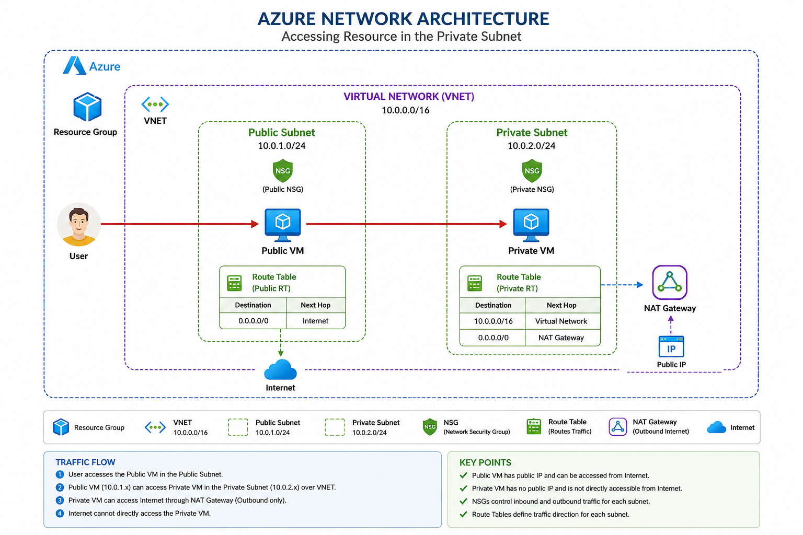

# Azure Production Network Setup Guide



## Architecture Overview

```text
Internet
   │
   ▼
Application Gateway / Load Balancer
   │
   ▼
Public Subnet (10.0.1.0/24)
   │
   ├── Bastion VM
   ├── Public VM
   ├── Public NSG
   └── Public Route Table
   │
   ▼
Private Subnet (10.0.2.0/24)
   │
   ├── Backend VM
   ├── Database
   ├── Redis
   ├── Private NSG
   └── Private Route Table
   │
   ▼
NAT Gateway (Outbound Internet Only)
```

---

# Step 1 — Create Resource Group

## Azure Portal

Open:

```text
https://portal.azure.com
```

Search:

```text
Resource Groups
```

Click:

```text
Create
```

Fill the details:

| Field | Value |
|---|---|
| Subscription | Your Subscription |
| Resource Group | prod-rg |
| Region | Central India |

Click:

```text
Review + Create
```

---

# Step 2 — Create Virtual Network (VNET)

Search:

```text
Virtual Networks
```

Click:

```text
Create
```

## Basics

| Field | Value |
|---|---|
| Resource Group | prod-rg |
| Name | prod-vnet |
| Region | Central India |

---

## IP Address Space

Remove the default subnet.

Set:

```text
10.0.0.0/16
```

---

# Step 3 — Create Public Subnet

Click:

```text
+ Add Subnet
```

Fill:

| Field | Value |
|---|---|
| Subnet Name | public-subnet |
| Address Range | 10.0.1.0/24 |

Click:

```text
Add
```

---

# Step 4 — Create Private Subnet

Again click:

```text
+ Add Subnet
```

Fill:

| Field | Value |
|---|---|
| Subnet Name | private-subnet |
| Address Range | 10.0.2.0/24 |

Click:

```text
Add
```

Then:

```text
Review + Create
```

---

# Step 5 — Create Public NSG

Search:

```text
Network Security Groups
```

Click:

```text
Create
```

Fill:

| Field | Value |
|---|---|
| Name | public-nsg |
| Resource Group | prod-rg |
| Region | Central India |

Create the NSG.

---

# Step 6 — Configure Public NSG Rules

Open:

```text
public-nsg
→ Inbound Security Rules
→ Add
```

## Allow SSH

| Field | Value |
|---|---|
| Service | SSH |
| Port | 22 |
| Protocol | TCP |
| Action | Allow |
| Priority | 100 |

---

## Allow HTTP

| Field | Value |
|---|---|
| Service | HTTP |
| Port | 80 |
| Action | Allow |
| Priority | 110 |

---

## Allow HTTPS

| Field | Value |
|---|---|
| Service | HTTPS |
| Port | 443 |
| Action | Allow |
| Priority | 120 |

---

# Step 7 — Create Private NSG

Create another NSG.

| Field | Value |
|---|---|
| Name | private-nsg |
| Resource Group | prod-rg |
| Region | Central India |

---

# Step 8 — Configure Private NSG Rules

Private subnet should not allow public internet traffic.

Allow only:

| Source | Port | Action |
|---|---|---|
| 10.0.1.0/24 | 22 | Allow |
| 10.0.1.0/24 | 3000 | Allow |
| VirtualNetwork | Any | Allow |

Do NOT allow:

```text
0.0.0.0/0
```

---

# Step 9 — Associate NSGs to Subnets

Go to:

```text
Virtual Networks
→ prod-vnet
→ Subnets
```

---

## Public Subnet

Attach:

```text
public-nsg
```

to:

```text
public-subnet
```

---

## Private Subnet

Attach:

```text
private-nsg
```

to:

```text
private-subnet
```

---

# Step 10 — Create Public Route Table

Search:

```text
Route Tables
```

Click:

```text
Create
```

Fill:

| Field | Value |
|---|---|
| Name | public-rt |
| Resource Group | prod-rg |
| Region | Central India |

---

# Step 11 — Configure Public Route

Open:

```text
public-rt
→ Routes
→ Add
```

Add:

| Field | Value |
|---|---|
| Route Name | internet-route |
| Destination CIDR | 0.0.0.0/0 |
| Next Hop Type | Internet |

This route sends traffic to internet.

---

# Step 12 — Associate Public Route Table

Attach:

```text
public-rt
```

to:

```text
public-subnet
```

---

# Step 13 — Create Private Route Table

Create another route table.

| Field | Value |
|---|---|
| Name | private-rt |
| Resource Group | prod-rg |

---

# Step 14 — Configure Private Route Table

## Recommended Production Setup

Use NAT Gateway for outbound internet.

Private servers should not have Public IP.

---

# Step 15 — Create NAT Gateway

A NAT Gateway allows private subnet resources to access the internet outbound only.

Example:

- apt update
- docker pull
- pip install

Internet users cannot directly access private VMs.

---

# NAT Gateway Architecture

```text
Private VM
   │
Private Subnet
   │
NAT Gateway
   │
Public IP
   │
Internet
```

---

# STEP 15.1 — Search NAT Gateway

Open Azure Portal:

```text
https://portal.azure.com
```

Search:

```text
NAT Gateway
```

Click:

```text
Create
```

---

# STEP 15.2 — Basics Tab

Fill the details:

| Field | Value |
|---|---|
| Subscription | Your Subscription |
| Resource Group | prod-rg |
| NAT Gateway Name | prod-nat |
| Region | Central India |
| Availability Zone | None |

Click:

```text
Next: Outbound IP
```

---

# STEP 15.3 — Configure Outbound Public IP

NAT Gateway requires a Public IP for outbound internet traffic.

---

## Click

```text
Create new Public IP address
```

---

## Fill Public IP Details

| Field | Value |
|---|---|
| Name | prod-nat-ip |
| SKU | Standard |
| Assignment | Static |
| Availability Zone | Zone-redundant (Optional) |

Click:

```text
OK
```

Now the Public IP is attached to the NAT Gateway.

---

# STEP 15.4 — Associate NAT Gateway with Private Subnet

This is the MOST IMPORTANT step.

Click:

```text
Next: Subnet
```

---

## Select Virtual Network

| Field | Value |
|---|---|
| Virtual Network | prod-vnet |

---

## Select Subnet

Check:

```text
private-subnet
```

Example:

```text
☑ private-subnet (10.0.2.0/24)
```

This means:

```text
All VMs inside private-subnet use NAT Gateway for outbound internet access.
```

---

# STEP 15.5 — Review + Create

Click:

```text
Review + Create
```

Then click:

```text
Create
```

Deployment usually takes 1–3 minutes.

---

# Verify NAT Gateway Association

Go to:

```text
Virtual Networks
→ prod-vnet
→ Subnets
→ private-subnet
```

You should see:

| Field | Value |
|---|---|
| NAT Gateway | prod-nat |

---

# Step 16 — Associate Private Route Table

Attach:

```text
private-rt
```

to:

```text
private-subnet
```

---

# Step 17 — Create Public VM

Search:

```text
Virtual Machines
```

Click:

```text
Create
→ Azure Virtual Machine
```

---

## Basics

| Field | Value |
|---|---|
| VM Name | bastion-vm |
| Image | Ubuntu 22.04 |
| Size | Standard_B2s |
| Authentication | SSH Key |

---

## Networking

| Field | Value |
|---|---|
| VNET | prod-vnet |
| Subnet | public-subnet |
| Public IP | Enabled |
| NSG | public-nsg |

Create VM.

---

# Step 18 — Create Backend VM

Create another VM.

---

## Basics

| Field | Value |
|---|---|
| VM Name | backend-vm |
| Image | Ubuntu 22.04 |
| Size | Standard_B2s |

---

## Networking

| Field | Value |
|---|---|
| VNET | prod-vnet |
| Subnet | private-subnet |
| Public IP | Disabled |
| NSG | private-nsg |

Create VM.

---

# Traffic Flow

```text
User
  │
  ▼
Public IP
  │
  ▼
Public VM / Load Balancer
  │
  ▼
Private Backend VM
  │
  ▼
Database / Redis
```

---

# Production Security Best Practices

## Public Subnet

Use for:

- Bastion Host
- Load Balancer
- Application Gateway
- Reverse Proxy

---

## Private Subnet

Use for:

- Backend APIs
- Databases
- Redis
- Kubernetes Worker Nodes
- AI/ML Services

---

# Important Security Rules

## Never Do This

❌ Open all ports:

```text
0.0.0.0/0
```

❌ Put database in Public Subnet

❌ Expose Backend VM to Internet

❌ Allow unrestricted SSH access

---

# Recommended Production Architecture

```text
Internet
   │
Azure Application Gateway
   │
Public Subnet
   │
Private Backend Subnet
   │
Database Subnet
```

---

# CIDR Reference

| CIDR | Meaning |
|---|---|
| 10.0.0.0/16 | VNET |
| 10.0.1.0/24 | Public Subnet |
| 10.0.2.0/24 | Private Subnet |

---

# Azure Components Explanation

| Component | Purpose |
|---|---|
| VNET | Private Network |
| Subnet | Network Segment |
| NSG | Firewall |
| Route Table | Traffic Routing |
| NAT Gateway | Outbound Internet |
| Public IP | Internet Access |
| Bastion VM | Secure SSH Access |

---

# Useful Azure Links

Azure Portal:

```text
https://portal.azure.com
```

Azure VNET:

```text
https://learn.microsoft.com/en-us/azure/virtual-network/
```

Azure NSG:

```text
https://learn.microsoft.com/en-us/azure/virtual-network/network-security-groups-overview
```

Azure Route Tables:

```text
https://learn.microsoft.com/en-us/azure/virtual-network/manage-route-table
```

Azure NAT Gateway:

```text
https://learn.microsoft.com/en-us/azure/nat-gateway/nat-overview
```

